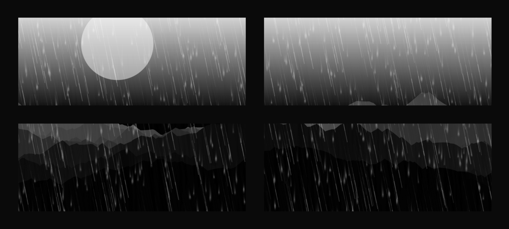

# 🌧️ Stormy Window

<div align="center">



### A cinematic storm simulation built with HTML, CSS, and JavaScript

Experience the atmosphere of a rain-soaked window brought to life with immersive visual effects, dynamic animations, and an engaging front-end experience.

[Live Demo](https://binaryvortex.github.io/Stormy-Window/)

</div>

---

## 📖 Overview

**Stormy Window** is a creative front-end project that recreates the feeling of looking through a window during a storm. Using modern web technologies, the project combines animation, visual effects, and interactive design to create an immersive weather-inspired experience directly in the browser.

This project demonstrates how JavaScript-driven animations and carefully crafted UI effects can transform a simple webpage into an engaging visual showcase.

---

## ✨ Features

- 🌧️ Realistic storm-inspired visual effects
- ⚡ Dynamic weather-themed animations
- 🎨 Clean and immersive user interface
- 🚀 Lightweight and fast-loading implementation
- 📱 Responsive browser experience
- 🧩 Built entirely with vanilla web technologies
- 🔧 Easy to customize and extend

---

## 🛠️ Technologies Used

- HTML5
- CSS3
- JavaScript (Vanilla JS)

---

## 📂 Project Structure

```text
Stormy-Window/
│
├── index.html      # Main application page
├── script.js       # Animation and interaction logic
├── logo.png        # Project logo
└── README.md       # Project documentation
```

---

## 🚀 Getting Started

### 1. Clone the Repository

```bash
git clone https://github.com/BinaryVortex/Stormy-Window.git
```

### 2. Navigate to the Project Folder

```bash
cd Stormy-Window
```

### 3. Open the Project

Simply open `index.html` in your preferred browser.

Alternatively, use a local development server such as VS Code Live Server.

---

## 🎯 Learning Objectives

This project was created to explore:

- Front-end animation techniques
- Browser-based visual effects
- JavaScript-driven interactions
- Creative UI design concepts
- Responsive web development practices

---

## 🌐 Live Demo

Try the project here:

https://binaryvortex.github.io/Stormy-Window/

---

## 🤝 Contributing

Contributions, suggestions, and improvements are welcome.

1. Fork the repository
2. Create a feature branch
3. Commit your changes
4. Push to your branch
5. Open a Pull Request

---

## 📜 License

This project is available for educational and personal use.

---

## 👨‍💻 Author

**Disandu Perera**

GitHub: https://github.com/BinaryVortex

---

### ⭐ If you enjoyed this project, consider giving it a star!
